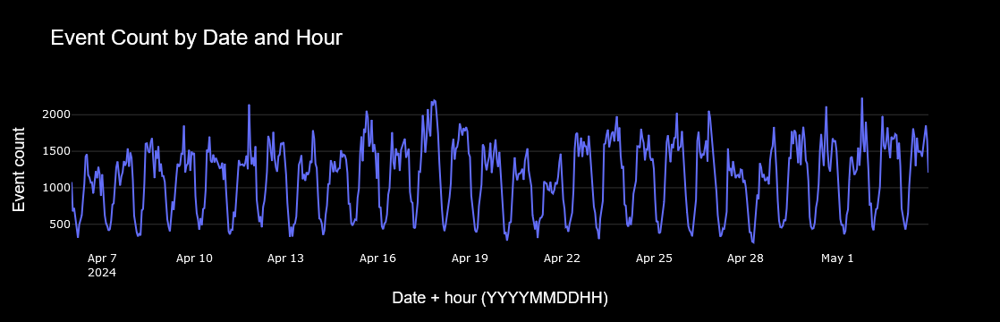
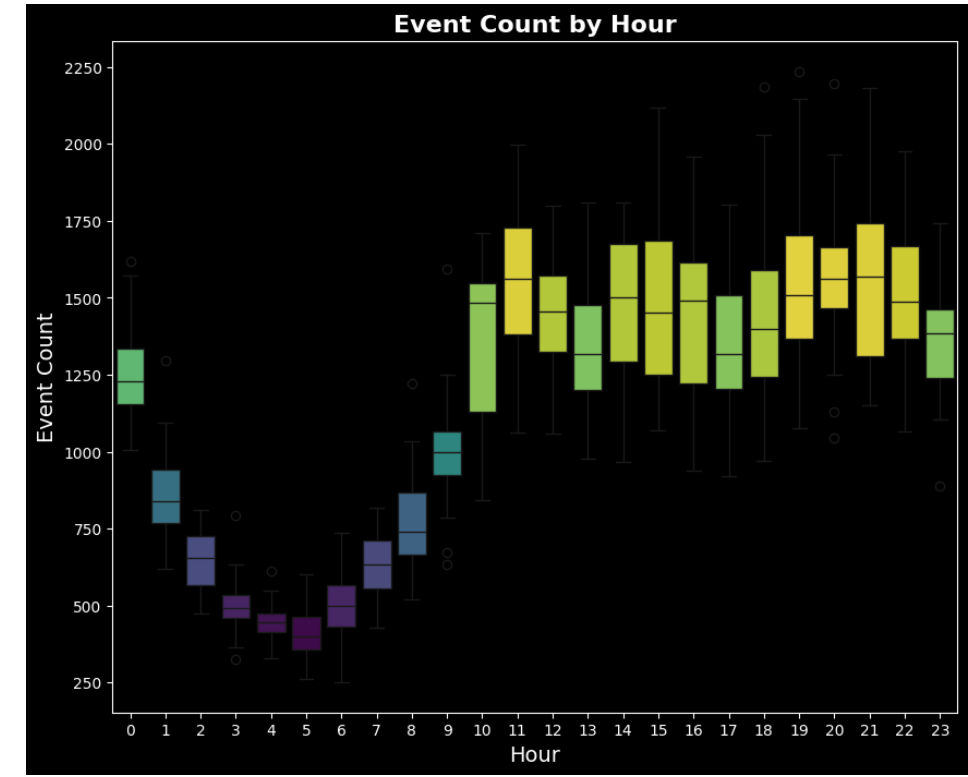
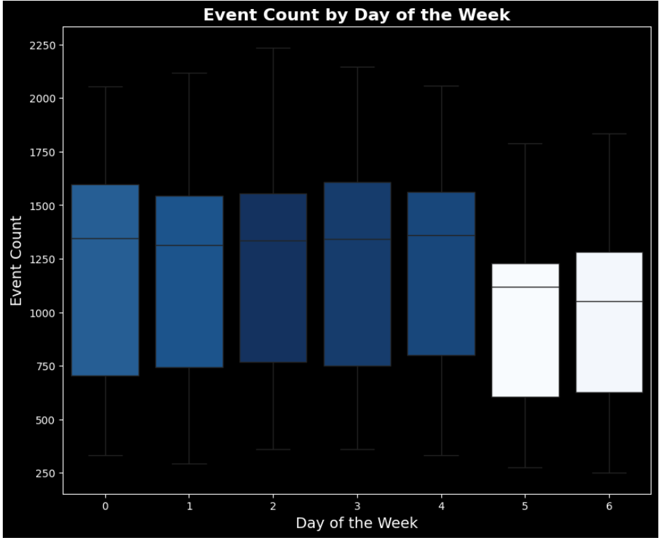
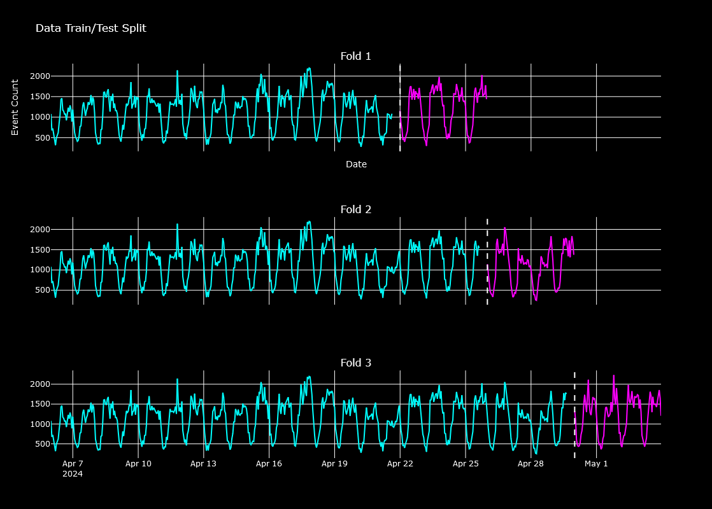
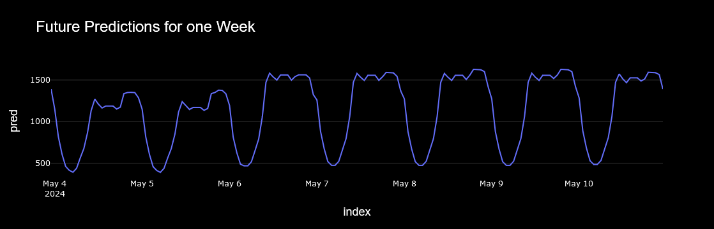
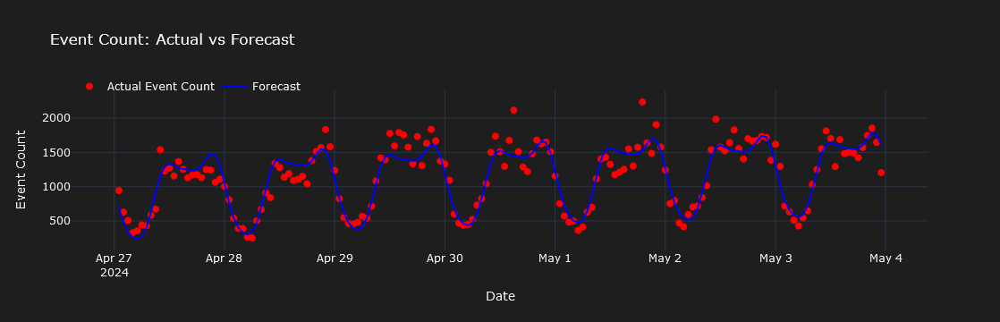
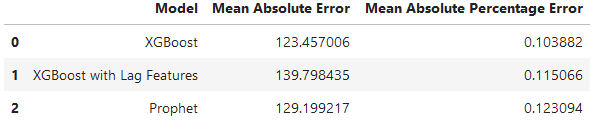

# Time Series Forecasting of Website Event Count

Predicting the Event Count over time is essential for optimizing resource allocation, improving planning, and enabling data-driven decision-making. Accurate forecasts help organizations allocate resources efficiently, identify trends that inform strategic initiatives, and detect anomalies or deviations from expected patterns. By utilizing advanced modeling techniques like XGBoost and Prophet, this project aims to deliver actionable insights that enhance operational effectiveness and drive meaningful outcomes for stakeholders.

## Resources Used

**Python Version**: 3.12.1

**Packages**: pandas,numpy,sklearn,matplotlib,seaborn,scipy, statsmodel, plotly, xgboost, prophet

**Dataset**: https://statso.io/website-performance-case-study/

## Data Preparation

In order to have the data ready to perform time series analysis it is necessary to have the date variable in a date format and to have it as an index. There were neither outliers, nor duplicated or null values.
Features such as hour and dayofweek were created to add more insights to the analysis.

The distribution of the Event count by Date and Hour is to be seen in the following graph

## Exploratory Data Analysis

Graphs were created to analyze the impact of the hour and day of the week on the Event count.

## Model Building

Three different models were built

### XGBoost

A 3Fold Data Train/Test was conducted for it. 

Future Predictions for one week

### XGBoost with Lag Features

### Prophet

## Model Performance

The three models achieved impressive results, each demonstrating a mean absolute error of less than 13%. Among them, **XGBoost** stood out as the top performer, with a **Mean Absolute Error** of **123.4** and a **Mean Absolute Percentage Error** of **0.103**.

